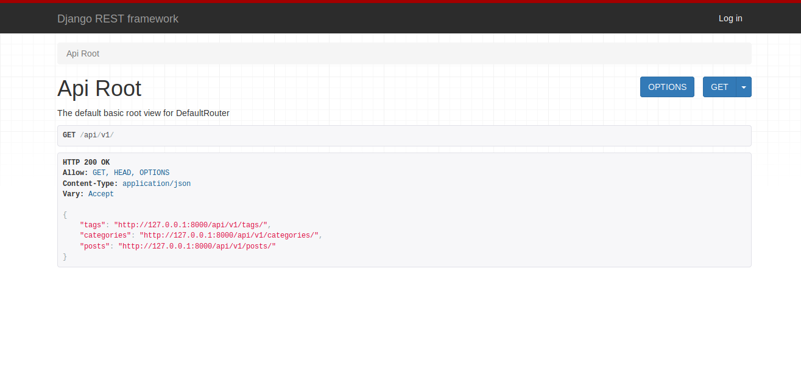
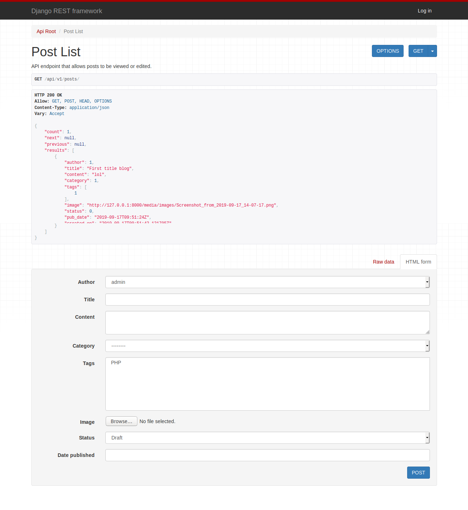

# Django REST API

Simple django REST API using django-rest-framework package.

### Install project dependencies and activate the pipenv shell
`$pipenv install`

`$pipenv shell`

### Run the app:
`$python manage.py makemigrations`

`$python manage.py migrate`

`$python manage.py runserver`

Enjoy :)

